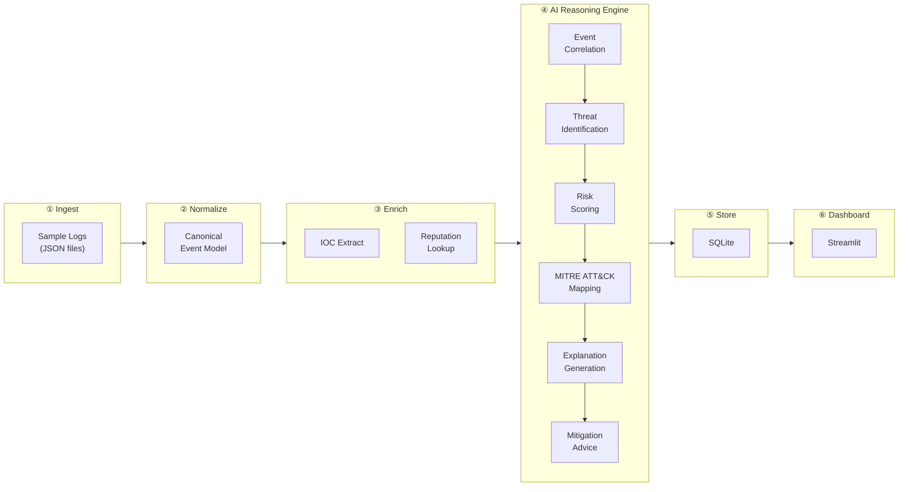
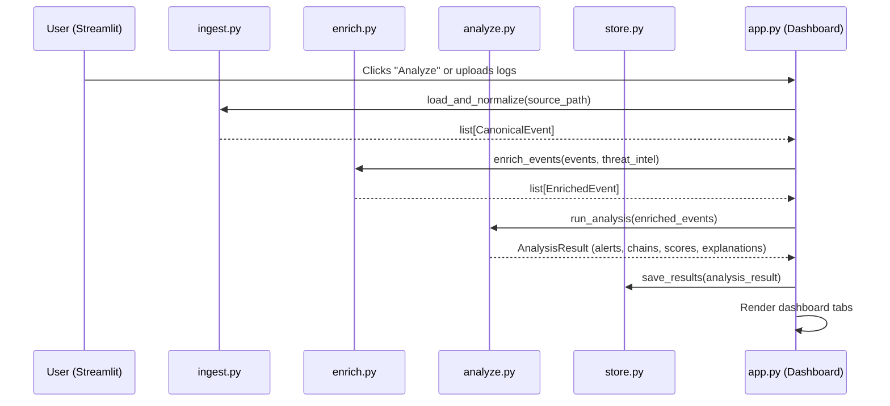
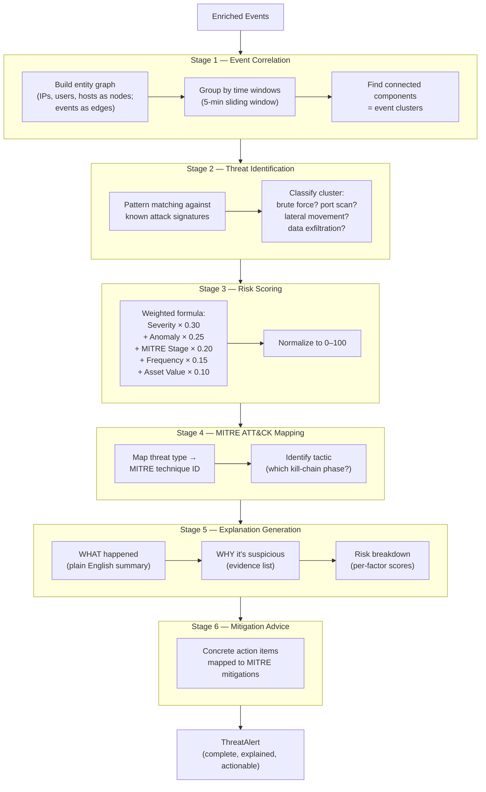

# AI Cyber Discovery Engine — Refined Architecture (Capstone MVP)

---

## 1. Design Philosophy

This is a **capstone demo**, not enterprise software. Every architectural decision is filtered through three questions:

1. **Can a judge see it?** — If a module produces no visible output in the demo, it doesn't belong.
2. **Can a student build it in hours, not days?** — If a module requires more infrastructure than insight, simplify it.
3. **Does it showcase AI reasoning?** — The AI engine is the star. Everything else is supporting cast.

The engine is a **six-stage pipeline** that transforms raw security logs into explained, prioritized, actionable threat intelligence — with AI reasoning at its core.

---

## 2. Final Architecture



Six stages. One direction. No cycles. Each stage is one Python file.

---

## 3. Simplified Module List

The entire engine lives in **7 Python files** inside a single `engine/` package. No sub-packages, no abstract base classes, no plugin registries.

| # | File | Pipeline Stage | What It Does | Why It Exists |
|---|------|---------------|--------------|---------------|
| 1 | `models.py` | Shared | Defines all data shapes — events, alerts, enums, risk scores | Without shared types, every module invents its own format. Pydantic catches bugs at construction time, not at demo time. |
| 2 | `ingest.py` | ① Ingest + ② Normalize | Loads sample JSON logs and transforms them into `CanonicalEvent` objects | Combined because they always run together. Separation only matters when you have 10+ source formats — we have 3. |
| 3 | `enrich.py` | ③ Enrich | Extracts IOCs (IPs, hashes, domains) and checks them against a local threat intel list | Turns raw data into *information*. An event saying "connection from 203.0.113.42" becomes "connection from a **known malicious scanner**." |
| 4 | `analyze.py` | ④ AI Reasoning | Correlation → Threat ID → Risk Scoring → MITRE Mapping → Explanation → Mitigation | **The core differentiator.** This is what makes the project "AI-powered" instead of "log viewer." |
| 5 | `store.py` | ⑤ Store | SQLite table creation + insert/query functions | Persists results so the dashboard can query without re-running the pipeline. Simple functions, no ORM. |
| 6 | `app.py` | ⑥ Dashboard | Streamlit application with tabbed views | The human interface. Judges see this. It must be visually impressive. |
| 7 | `config.py` | Shared | Loads `config.yaml` into a single flat dictionary | One file, one function, one dict. No nested Pydantic hierarchies. |

### Why each module earns its place

Every module produces something **visible in the demo**:

| Module | What the judge sees |
|--------|-------------------|
| `ingest.py` | "It accepts multiple log formats" |
| `enrich.py` | "It identifies indicators of compromise automatically" |
| `analyze.py` | "It correlates events, detects anomalies, scores risks, explains threats, and recommends actions" |
| `store.py` | "Results persist — I can close and reopen the dashboard" |
| `app.py` | "Beautiful interactive dashboard with graphs, heatmaps, and AI explanations" |

---

## 4. Final Folder Structure

```
ai-cyber-discovery-engine/
│
├── app.py                         # Streamlit entry point (⑥ Dashboard)
├── config.yaml                    # Runtime configuration (flat, minimal)
├── requirements.txt               # Python dependencies
├── README.md                      # Project overview + setup instructions
│
├── data/                          # Sample data & knowledge bases (bundled, offline)
│   ├── sample_logs/
│   │   ├── auth_logs.json         # Simulated authentication events
│   │   ├── firewall_logs.json     # Simulated firewall events
│   │   └── network_logs.json      # Simulated network traffic events
│   ├── mitre_attack.json          # Local MITRE ATT&CK technique database
│   └── threat_intel.json          # Known-bad IPs, domains, hashes
│
├── engine/                        # Core engine — one file per pipeline stage
│   ├── __init__.py                # Exports public API
│   ├── models.py                  # All data models (Pydantic)
│   ├── config.py                  # Configuration loader
│   ├── ingest.py                  # ① Ingest + ② Normalize
│   ├── enrich.py                  # ③ Enrich (IOCs + reputation)
│   ├── analyze.py                 # ④ AI Reasoning Engine (the star)
│   └── store.py                   # ⑤ SQLite persistence
│
└── tests/
    └── test_engine.py             # Single test file covering critical paths
```

**Total: 15 files, 3 directories.** Down from 40+ files and 12+ directories in the original design.

---

## 5. Data Flow



**Key simplification:** The Streamlit app orchestrates the pipeline directly. No need for a separate pipeline runner, CLI script, or message queue. The user clicks a button, the pipeline runs, results appear. Simple.

---

## 6. AI Reasoning Flow — The Core Differentiator

This is the module that earns the "AI-powered" label. It has **six sequential stages**, each answering a specific question:



### Why each stage exists

| Stage | Question It Answers | Why It Matters for the Demo |
|-------|--------------------|-----------------------------|
| **1. Event Correlation** | "Which events belong together?" | Shows the engine discovers attack *patterns*, not just individual log lines. Uses NetworkX graph analysis — visually impressive when rendered. |
| **2. Threat Identification** | "What kind of attack is this?" | Transforms a cluster of events into a named threat ("Brute Force Attack"). Judges immediately understand the output. |
| **3. Risk Scoring** | "How dangerous is this?" | A 0–100 score with per-factor breakdown. Fully transparent — the judge can see *why* the score is 87, not a black-box number. |
| **4. MITRE ATT&CK Mapping** | "Where does this fit in the attack lifecycle?" | Industry-standard framework. Shows research awareness. Enables the heatmap visualization in the dashboard. |
| **5. Explanation Generation** | "Why should a human care?" | The "wow factor." Template-driven natural language: *"14 failed SSH logins from a known scanner, followed by a successful login and privilege escalation."* |
| **6. Mitigation Advice** | "What should I do about it?" | Concrete, actionable steps. Turns the engine from a detection tool into an **advisory system**. |

### Anomaly Detection (within Stage 3)

Isolation Forest (scikit-learn) runs as a sub-step of risk scoring:
- **Input:** Feature vector per event cluster — `[event_count, unique_sources, time_span, port_diversity, hour_of_day]`
- **Output:** Anomaly score (0.0–1.0) fed into the risk formula
- **Why Isolation Forest?** Unsupervised (no labeled data needed), works on small datasets, fast, and the anomaly score is directly interpretable

---

## 7. Technology Stack

| Concern | Technology | Why This, Not Something Else |
|---------|-----------|------------------------------|
| Language | **Python 3.11+** | Team knows it. Rich security/ML ecosystem. |
| Data Models | **Pydantic v2** | Catches type errors at construction, not at demo time. Free JSON serialization. |
| ML | **scikit-learn** | Isolation Forest in 5 lines. No GPU, no training pipeline, no complexity. |
| Graphs | **NetworkX** | Pure Python. Build a graph, find connected components, render it. Perfect for correlation. |
| Visualization | **Plotly** | Interactive charts that work inside Streamlit. Heatmaps, timelines, network graphs. |
| Dashboard | **Streamlit** | Pure Python, zero JS, tabs and widgets out of the box. Looks professional with minimal effort. |
| Storage | **SQLite** | Ships with Python. Single file. Full SQL. Zero setup. |
| Config | **PyYAML** | Load a YAML file into a dict. That's it. |
| Threat Intel | **MITRE ATT&CK JSON** | Bundled offline. No API keys, no rate limits, no network dependency during demos. |
| Templating | **Python f-strings** | For explanation generation. Jinja2 is overkill when you have 4–5 templates. |
| Testing | **pytest** | One file, critical paths only. Not a test pyramid — a test sanity check. |

### What's NOT in the stack (and why)

| Removed | Reason |
|---------|--------|
| FastAPI / REST API | No consumer. Streamlit talks to the engine directly via function calls. |
| Jinja2 | f-strings and simple template functions cover our 4–5 explanation templates. |
| Abstract Base Classes | With 2–3 ingestors, a base class adds ceremony without value. Just write functions. |
| ORM (SQLAlchemy) | 3 tables, 5 queries. Raw SQL is clearer and faster to write. |
| Docker | Adds setup friction. `pip install -r requirements.txt && streamlit run app.py` is the entire setup. |

---

## 8. Implementation Order

Five phases, designed so that **every phase produces a runnable demo**. If you run out of time after Phase 3, you still have a working product.

| Phase | What to Build | Time Estimate | Demo After This Phase |
|-------|--------------|---------------|----------------------|
| **1** | `models.py` + `config.py` + `config.yaml` + sample data files | ~1 hour | "Here are our data models and sample attack data" |
| **2** | `ingest.py` + `enrich.py` | ~1.5 hours | "The engine ingests logs, normalizes them, and identifies IOCs" |
| **3** | `analyze.py` (all 6 stages) | ~2.5 hours | "The AI engine correlates events, scores risk, maps to MITRE, and explains threats in plain English" |
| **4** | `store.py` | ~30 min | "Results persist in SQLite" |
| **5** | `app.py` (Streamlit dashboard with all tabs) | ~2.5 hours | **Full demo: interactive dashboard with threat overview, alert details, attack graphs, and MITRE heatmap** |

**Total: ~8 hours.** Buildable in one focused day.

### Why this order?

- **Phase 1** establishes the data contracts. Everything downstream depends on these shapes.
- **Phase 2** gives you data flowing through the pipeline — you can `print()` enriched events and verify correctness.
- **Phase 3** is the longest and most important. It's the capstone differentiator. Give it the most time and attention.
- **Phase 4** is deliberately small — just enough SQL to persist and query results.
- **Phase 5** wraps everything in a visual interface. Streamlit is fast to build, so this phase is mostly layout and chart configuration.

---

## 9. What Was Removed and Why

| Original Feature | Decision | Justification |
|-----------------|----------|---------------|
| Plugin Registry (`registry.py`) | **Removed** | Dynamic plugin discovery is an enterprise pattern. With 3 ingestors, just import them directly. |
| Abstract `IngestorBase` class | **Removed** | Adds a file and an abstraction layer for 3 concrete classes. Plain functions are clearer. |
| Repository Pattern (`repositories.py`) | **Removed** | Adds an abstraction layer over 5 SQL queries. Direct SQLite calls are faster to write and easier to understand. |
| Database Migrations (`migrations.py`) | **Removed** | We have one schema version. A `CREATE TABLE IF NOT EXISTS` in `store.py` handles it. |
| FastAPI REST API | **Removed** | No external consumer. Streamlit calls engine functions directly. Adding an API doubles the surface area with zero demo value. |
| GeoIP Lookup (`geo_lookup.py`) | **Removed** | Requires a 60MB MaxMind database download. Adds setup friction for marginal demo value. |
| LRU Cache (`cache.py`) | **Removed** | SQLite is fast enough for our data volume. Caching adds complexity to solve a performance problem we don't have. |
| Separate `normalization/` package | **Merged into `ingest.py`** | Normalization and ingestion always run together. Separate packages only make sense when different teams own them. |
| 7-level Pydantic config hierarchy | **Simplified to flat loader** | One function loads YAML into a dict. Nested typed config models are overengineering for 15 config keys. |
| Extensive pytest structure (`test_core/`, `test_ingestion/`, etc.) | **Collapsed to one file** | One `test_engine.py` covering the critical pipeline path. A test pyramid is for teams with CI/CD, not for capstone demos. |
| Enterprise structured logging | **Removed** | `print()` and basic `logging.info()` are sufficient. Structured logging frameworks add dependencies for log analysis infrastructure we don't have. |
| Jinja2 templating for explanations | **Replaced with f-strings** | We have ~5 explanation templates. Python f-strings with helper functions are simpler and have zero dependencies. |
| `scripts/` directory | **Removed** | The pipeline runs from `app.py`. No need for separate CLI scripts. |
| `notebooks/` directory | **Removed** | The Streamlit dashboard serves as the exploration interface. |
| Separate `components/` package for Streamlit | **Inlined into `app.py`** | With 3–4 reusable components, a separate package adds navigation overhead for minimal reuse benefit. |

---

## 10. Future Enhancements (Not Implemented)

These are explicitly **out of scope** for the MVP but are worth mentioning during the demo as "future work":

| Enhancement | What It Would Add |
|-------------|------------------|
| **LLM-powered explanations** | Replace f-string templates with Gemini/GPT calls for more fluid, context-aware prose |
| **Real-time streaming** | Replace batch file ingestion with a live log tail or syslog listener |
| **STIX/TAXII integration** | Consume real threat intelligence feeds instead of a static JSON file |
| **User authentication** | Role-based access for analyst vs. admin views |
| **REST API** | Expose the engine's capabilities to external tools and SOAR platforms |
| **PDF report export** | Generate downloadable incident reports from threat alerts |
| **GeoIP mapping** | Visualize attack origins on a world map |
| **Custom detection rules** | Let analysts define their own correlation rules via the dashboard |
| **Historical trend analysis** | Compare current threat posture against past baselines |
| **Multi-tenant support** | Separate data and views per organization |

---

## Summary

| Metric | Original | Refined |
|--------|----------|---------|
| Files | 40+ | **15** |
| Directories | 12+ | **3** |
| Python packages | 7 | **1** (`engine/`) |
| Config models | 7 nested Pydantic classes | **1 dict from YAML** |
| Test files | 5+ | **1** |
| Build time estimate | Multiple days | **~8 hours** |
| External dependencies | 10+ | **7** (pydantic, pyyaml, networkx, scikit-learn, plotly, streamlit, pandas) |
| Enterprise patterns | 6 (repository, migrations, plugins, DI, cache, API) | **0** |
| Demo-visible modules | ~60% | **100%** |

> [!IMPORTANT]
> **This architecture is ready for your review.** No code will be generated until you explicitly approve this design. If you want any modules added, removed, or restructured — say so now, before implementation begins.
